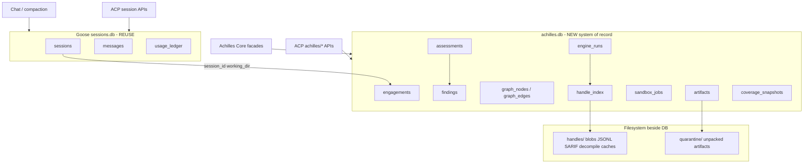
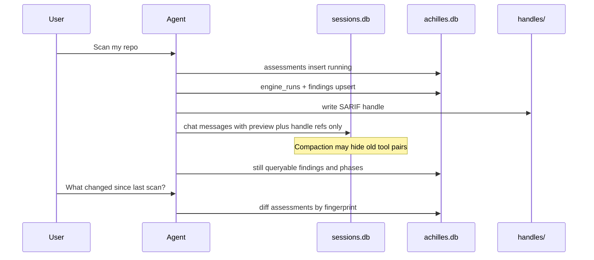
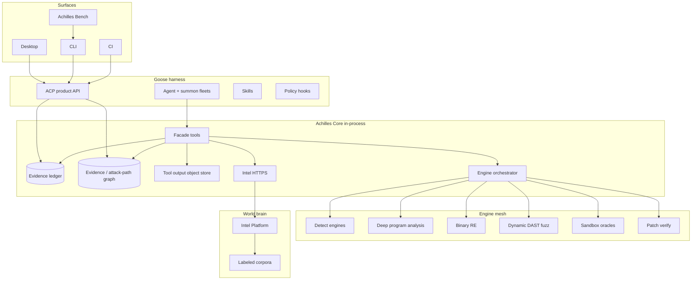
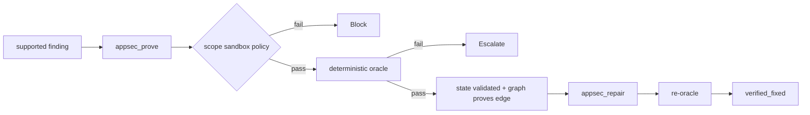

# Achilles — God-Tier Security Agent Harness Plan

## North star

**Achilles is not “Goose for cybersecurity.”** It is the harness the industry points at when they say *agentic security done right*: an expert model (Arrav or BYO) living inside an **unmatched tool-call operating system**—evidence-first, proof-capable, source-to-binary-to-runtime, with a world-brain of intel—and a UX that feels like talking to the best AppSec engineer alive (“do I have this issue?” / “scan my repo”), not picking scanner checkboxes.

**World-renowned bar:** published benchmarks, proof-or-it-didn’t-happen culture for high severities, tool depth that makes MCP-toolbox demos look thin, architecture clean enough to stay goose-mergeable and ship proprietary power.

**You + model in this harness = god tier** when the tool substrate is god tier. Models without tools hallucinate. Tools without orchestration are a junk drawer. Achilles unifies both.

---

## Decisions locked

- **Ambition:** God-tier / world-renowned unmatched tool-call capacity for authorized security work.
- **UX:** Concern chat + **Scan my repo** (and deeper engagement starters). No per-vuln recipe gallery.
- **Models:** Full goose BYO registry + Arrav local default (`goose-local-inference`).
- **Integration:** Multi-layer Core — **platform extension primary**, managed engines, direct intel HTTPS, ACP product APIs, skills/summon/hooks, MCP **secondary** only. Never dump into `agent.rs`. Never make freeform `shell` the product backbone.
- **Evidence doctrine:** Findings have a lifecycle: `hypothesis → supported → validated → remediated → verified_fixed`. Critical/High prefer validation evidence when sandbox/target available.
- **Power Tiers 1→6:** Ship value early; god-tier = through Tier 5 minimum, Tier 6 for unmatched crown.
- **RAG:** Unlimited data welcome—**versioned, labeled, safety-classed corpora** with retrieval evals.
- **Ethics/scope:** Authorized workspace + allowlisted targets only; dangerous capability behind gates + sandbox.
- **Persistence (locked):** **Dual SQLite.** Reuse goose `sessions.db` for conversations/compaction. Ship a separate **`achilles.db`** for engagements, assessments, findings, rescans, graph, engine runs, handle index—never store AppSec system-of-record only inside chat messages.
- **Mergeability:** Proprietary crates; thin goose registration; delay protocol/binary rename.

---

## 0A. Persistence — Goose today vs Achilles needs (plan HARD)

### Verdict (short)

| Need | Already in Goose? | Achilles decision |
|------|-------------------|-------------------|
| Conversation / chat history | **Yes — SQLite `sessions.db`** | **Reuse as-is** |
| Compaction / tool-pair summarization | **Yes** (visibility flags + summary messages) | **Reuse**; add AppSec-aware hooks |
| Token/usage ledger | **Yes** (`usage_ledger`) | Reuse |
| Working-dir / project association | **Yes** (`working_dir`, optional `project_id`) | Reuse as engagement join key |
| Scan history / what was scanned / when / rescan / status | **No** | **New `achilles.db`** |
| Findings lifecycle / graph / handles | **No** (only buried in message JSON if at all) | **New `achilles.db` + handle files** |
| Assessment progress for UI | **No** | **New + ACP** |

**Do not invent a second conversation store.** **Do not** make findings survive only as assistant prose or tool blobs inside `messages.content_json`—compaction and UI will betray you.

### How Goose already handles conversations

Canonical implementation: [`crates/goose/src/session/session_manager.rs`](crates/goose/src/session/session_manager.rs).

- **DB path:** `{data_dir}/sessions/sessions.db` (WAL mode, 30s busy timeout, schema v15)
- **Windows default `data_dir`:** `%APPDATA%\Block\goose\data\` (unless `GOOSE_PATH_ROOT`)
- **Tables that matter:** `sessions`, `messages`, `usage_ledger` (+ provider inventory in same file)
- **Session row:** `working_dir`, name, timestamps, archive, recipe, provider/model snapshot, token totals, `project_id`, `parent_session_id` (subagents)
- **Messages:** full `content_json` (including **entire tool results**), `metadata_json` (`userVisible` / `agentVisible`, usage, compaction flags)
- **ACP:** `session/list`, `session/load`, `session/new`, delete/fork/export/import, plus `_goose/unstable/session/*` manage APIs
- **Desktop** groups by `working_dir` ([`projectSessions.ts`](ui/desktop/src/utils/projectSessions.ts))

**Compaction** ([`context_mgmt/`](crates/goose/src/context_mgmt/), `ops_compaction.rs`, `ops_tool_pair_compaction.rs`):

1. **Full compaction:** LLM summarizes history → old messages stay in DB but `agentVisible=false` (still user-visible in UI) → new summary + continuation messages for the model → `replace_conversation` rewrite path for full compact
2. **Tool-pair summarization:** old tool request/response pairs hidden from agent via metadata; summary message appended; **rows not deleted**
3. Triggers: auto at ~80% context (`GOOSE_AUTO_COMPACT_THRESHOLD`), reactive on context errors, `/compact`

**Todo extension** already persists across compaction via `extension_data` on the session row—pattern to remember, not to overload with findings.

### What Goose does *not* give you (the whole AppSec product)

- No first-class “assessment,” “scan run,” “engine invocation,” “finding,” “rescan diff,” or “evidence graph” tables
- Security inspector “findings” are runtime/tool-stream only—not queryable scan history
- No durable “last scanned commit SHA / fingerprint / coverage map”
- No handle store for multi-megabyte Semgrep/CodeQL/Nuclei outputs (they would bloat `messages` if dumped into chat)

### Locked Achilles persistence architecture



**Paths (recommended):**

- Keep goose: `{data_dir}/sessions/sessions.db`
- Add: `{data_dir}/achilles/achilles.db` (WAL)
- Add: `{data_dir}/achilles/handles/{handle_id}/...`
- Add: `{data_dir}/achilles/quarantine/...`
- Optional later: `{workspace}/.achilles/` only for **project-local** caches the user wants in-repo (default off—prefer app data so clones stay clean)

Link keys everywhere: `engagement_id`, `session_id` (goose), `working_dir` (normalized), `git_head` / `content_fingerprint`, `assessment_id`.

### `achilles.db` schema (god-tier, ship incrementally)

**engagements**
- `id`, `working_dir`, `project_id` (optional), `display_name`
- `created_at`, `updated_at`, `last_assessment_at`
- `privacy_flags` (snippet_upload, network_probes, git_history, …)
- `scope_urls_json`, `exclude_globs_json`
- `fingerprint_json` (languages, frameworks, package managers—cached)
- `status` (`active|archived`)

**assessments** (a scan / concern deep-dive / repair mission)
- `id`, `engagement_id`, `session_id` (goose chat that drove it—nullable for CI headless)
- `mode` (`full|quick|diff|artifact|runtime|concern|release_gate|repair`)
- `status` (`queued|running|cancelling|completed|failed|partial`)
- `started_at`, `finished_at`, `updated_at`
- `parent_assessment_id` (rescan lineage)
- `base_git_sha`, `head_git_sha`, `content_fingerprint`
- `phases_json` (phase name → status/timestamps/counts)
- `stats_json` (findings by severity, engines run, duration)
- `error_message`, `engine_versions_json` (Bench replay)
- `trigger` (`user_chat|scan_cta|cli|ci|schedule`)

**findings**
- Full Finding schema + `engagement_id`, `assessment_id` (introduced), `last_seen_assessment_id`
- `state` lifecycle enum
- `fingerprint` (stable dedupe key: rule+path+sink hash)
- `first_seen_at`, `last_seen_at`, `validated_at`, `verified_fixed_at`
- `severity`, `confidence`, `category`, `cwe_json`, `cve_json`
- `evidence_json` (small) + `evidence_handle_ids_json` (large)
- `owner`, `notes`, `status_reason`

**finding_events** (audit trail)
- `finding_id`, `at`, `actor` (`agent|user|engine|policy`), `from_state`, `to_state`, `assessment_id`, `detail_json`

**engine_runs**
- `id`, `assessment_id`, `engine`, `pack`, `status`, `started_at`, `finished_at`
- `argv_fingerprint`, `exit_code`, `summary_json`, `output_handle_id`, `stats_json`

**coverage_snapshots**
- What was covered in an assessment: paths globs, languages, packs, engines skipped + reasons
- Enables “what haven’t we scanned?” and honest `appsec_coverage`

**graph_nodes / graph_edges**
- Evidence / attack-path graph (or JSON graph per assessment in v1, normalized tables by Tier 3)

**artifacts**
- Hash, type, path/quarantine ref, signature info, decompile_handle_id

**sandbox_jobs**
- Profile, status, timestamps, oracle result, log_handle_id, finding_id

**handle_index**
- `handle_id`, `kind` (`sarif|jsonl|decompile|log|sbom|raw`), `path`, `bytes`, `sha256`, `created_at`, `assessment_id`, `expires_at`

**intel_cache** (optional local)
- Advisory lookups with TTL—offline partial brain

### Rescan / status / timestamps — first-class product behavior

This is exactly why `achilles.db` exists:

1. **Scan my repo** creates `assessments` row `status=running`, phases tick via ACP.
2. Engines write `engine_runs` + handles; findings upsert by `fingerprint` (new → `first_seen_at`; existing → `last_seen_at` / state transitions).
3. Completion: `finished_at`, stats, coverage snapshot.
4. **Rescan** creates child assessment with `parent_assessment_id`, optional `mode=diff` using `base_git_sha`/`content_fingerprint` vs previous.
5. UI: “Last full scan 2h ago · 12 open · 3 fixed since last · Rescan”.
6. Agent tools: `appsec_query` / `appsec_assessment_*` read DB—not “try to remember from chat.”
7. After compaction, **chat may lose tool detail**; **ledger still answers** “what did we find on auth last Tuesday?”

### Compaction + AppSec — pitfalls and mitigations

| Pitfall | What happens | Mitigation |
|---------|--------------|------------|
| Findings only in tool messages | Compaction sets `agentVisible=false` or summarizes away evidence | Ledger is SoR; compaction prompt **injects assessment summary from DB** |
| Huge Semgrep dumps in chat | `sessions.db` balloons; compact fails; UI crawls | Tools return **handles + preview**; full output never in `content_json` |
| Tool-pair summarization loses CVE lists | Agent “forgets” mid-engagement | Before summarize, ensure `finding_emit` / engine_run already committed |
| Auto-compact mid-scan | Agent loses phase context | Assessment phases live in DB; on compact, write phase digest into summary via Core hook |
| Subagent sessions | Separate goose sessions; easy to orphan findings | Always pass `engagement_id`/`assessment_id` into fleet tools; findings keyed there not only `session_id` |
| User deletes chat session | Would delete “the scan” if SoR were messages | Deleting goose session **does not** delete `achilles` assessments (link becomes null); optional GC policy later |

**AppSec-aware compaction enhancement (Tier 1–2):** when compacting a session tied to an engagement, Core supplies a structured block: open findings counts, last assessment id/status, top severities, coverage gaps—so Arrav retains mission state even when tool transcripts shrink.

### Conversation tracking — use Goose; enhance only where needed

- Session list/load/rename/archive: **already built**
- Optionally set goose `session.name` from assessment (“Full scan · repo · timestamp”) via existing rename ACP
- Store `engagement_id` in session `extension_data` (same pattern as todo) for quick join—**small** metadata only
- Do **not** fork goose schema for findings inside `sessions.db` (migration hell + upstream sync pain + size coupling)

### Same DB vs separate DB

**Separate `achilles.db` wins** for god tier:

- Independent migrations / LICENSE-ACHILLES ownership
- Scan/handle growth won’t corrupt chat UX if AppSec GC is aggressive
- Backup/export “security engagement bundle” without exporting all chats
- Multiple writers still need discipline—but blast radius is isolated
- Upstream goose migrations (v15→vN) won’t collide with AppSec DDL

**Same DB only if** forced by ops simplicity—and even then use separate tables with clear prefix; still not recommended.

### Handles: SQLite vs filesystem

- **Index in SQLite** (`handle_index`)
- **Blobs on disk** under `handles/` (SARIF, JSONL, decompile text)
- Why: SQLite BLOB for multi-100MB CodeQL DBs / SARIF is a footgun; filesystem + SHA256 is Bench-friendly and easy to GC
- Soft limit + LRU GC for handles older than N days if finding not open

### Goose / Windows / OneDrive pitfalls (you are on OneDrive Desktop for the *repo*)

| Risk | Detail | Mitigation |
|------|--------|------------|
| SQLite + cloud sync | WAL + OneDrive on DB path → corruption | Keep DBs under `%APPDATA%\...` (default), **never** put `sessions.db`/`achilles.db` inside the synced repo |
| Exact `working_dir` string match | `C:\...\repo` vs `c:\...\repo` vs trailing slash → split session lists | Normalize paths on write (canonicalize) in Achilles engagement layer |
| Multi `goose serve` | Two backends → two writers on WAL | Desktop lease registry already prefers one serve; document “one backend” |
| DB growth | Tool outputs historically in messages | Handles discipline + optional session vacuum/export archive |
| Secrets in chat DB | File reads / `.env` contents persist in `messages` | Redact high-entropy in tool previews; findings store **redacted** snippets; warn in privacy UI |
| No built-in repair | Corrupt DB = restore backup | Periodic copy of `achilles.db` + `sessions.db` to `backups/` (Tier 1 feature) |
| Dead `threads` tables | Goose schema noise | Ignore; don’t build on them |
| Compaction threshold | Local Arrav small context → frequent compact | Lower-context models need **stronger** ledger reliance + shorter tool previews |

### Context / summaries / tooling — how it all fits



God-tier context strategy:

1. **Working memory** = goose messages (compacted)
2. **Mission memory** = `achilles.db` assessments/findings/graph
3. **Bulk memory** = handles on disk
4. **World memory** = Intel Platform RAG
5. Agent uses facades to pull the right layer—never stuff all layers into the prompt

### Tier-1 persistence deliverables (concrete)

1. Create `achilles` data dir + SQLite schema migrations crate (`achilles-findings` / `achilles-store`)
2. WAL + `BEGIN IMMEDIATE` + backup helper (mirror goose patterns)
3. ACP: list assessments, get progress, list findings, rescan
4. Facades write ledger on every scan/investigate
5. Path canonicalization + engagement upsert on workspace pick
6. Compaction hook: inject engagement digest when `extension_data.engagement_id` set
7. Do **not** modify goose `sessions.db` schema for findings

---

## 0. The god-tier agent test (pass/fail)

An agent inside Achilles must be able to answer **yes** to all of the following on in-scope work:

1. Can I **see everything that matters**—source, lockfiles, CI, IaC, build artifacts, containers, mobiles, native libs?
2. Can I **run best-in-class detectors** (not toy regex) and normalize them into one ledger?
3. Can I **never invent a CVE**—only assert advisories the intel plane returns?
4. Can I perform **deep program analysis** (interprocedural dataflow / CodeQL-class), not only pattern SAST?
5. Can I map **vulnerable dependency → reachable code path** (reachability), not just “CVE exists in lockfile”?
6. Can I **inspect and decompile** what ships (PE/ELF/Mach-O, JVM/.NET, APK)?
7. Can I **attack my conclusions** with DAST/Nuclei-class templates, crawl/fuzz, and lab crypto tools?
8. Can I **prove** impact in a **sandbox with deterministic oracles** (“no exploit, no Critical” option)?
9. Can I **patch and re-attack** (repair loop) until the oracle goes green?
10. Can I maintain an **evidence graph** linking source ↔ binary ↔ dynamic ↔ intel ↔ fix?
11. Can I **fan out specialist fleets** (secrets, SCA, SAST, RE, DAST) without context collapse?
12. Can I stay **safe**—scope gates, egress policy, no host detonation?

If any row is “sort of,” we are not god tier yet. This plan exists to make every row true.

### Competitive posture (why we can be unmatched)

Others ship: MCP bags of CLIs, SAST chatbots, or single-model “security coding.” Achilles differentiates by **all of**:

- In-process Core + engine quality (not IPC-only MCP soup)
- Facade tool UX that scales to 150+ underlying capabilities without melting Arrav’s context
- Evidence ledger + attack-path graph as first-class substrate
- Deep PA (CodeQL-class) + commodity SAST + SCA reachability
- Full RE/decompile tier
- DAST + OOB + sandbox oracles + repair loop
- Unlimited structured RAG world-brain
- Specialist fleets with tool-output virtualization
- Public Achilles Bench (world-renowned requires receipts)

---

## 1. Product ideology

| Layer | God-tier role |
|-------|----------------|
| Harness | Goose resurfaced as Achilles — sessions, ACP, approvals, steerable agent loop |
| Model | Arrav (cyber-specialized local) or any frontier BYO |
| Scope | Workspace + allowlisted runtime targets + cloud/K8s contexts (gated) |
| Core | Platform extension: facades, ledger, graphs, orchestration |
| Engine mesh | 100+ managed capabilities behind Core (see catalog) |
| World-brain | Intel Platform + unlimited corpora |
| Sandbox fleet | PoC, fuzz, untrusted binary, repair verification |
| Fleets | Specialist subagents with scoped tool views |
| Product API | ACP = system of record (UI never scrapes chat) |

**UX anti-pattern (banned):** “Enable CORS check / SQLi check” marketplace.  
**UX pattern (required):** Talk like an engagement lead; one **Scan** CTA; chips are natural language.

---

## 2. Engagement model

### Mode A — Concern investigation
“Do we have IDOR?”, “Is this JWT forgeable?”, “Decompile auth in this APK”, “Prove this SSRF”, “Did CVE-2024-… actually reach us?”

### Mode B — Full engagements
- **Scan my repo** — comprehensive white-box (+ artifacts if present)
- **Release gate** — policy-fail on validated Critical/High
- **Artifact assessment** — binaries/containers/mobiles emphasized
- **Runtime assessment** — allowlisted base URL / compose stack up
- **Repair mission** — find → validate → patch → re-validate

Chips insert NL prompts; skills load invisibly by intent.

---

## 3. Architecture — multi-layer (god-tier substrate)



### Why this beats “just MCP”

| Need | God-tier answer |
|------|-----------------|
| 150+ capabilities | Facades + internal mesh; MCP secondary |
| Huge tool outputs | **Handles**: tools return `output_ref` + summary; model fetches slices |
| Parallelism | Fleet summon + orchestrator fanout |
| UI truth | ACP reads same ledger |
| Proof culture | Sandbox oracles write `validated` edges into graph |
| Merge safety | Proprietary crates + thin platform registration |

### Crates

`achilles-appsec`, `achilles-store` (SQLite `achilles.db` migrations), `achilles-findings` (schema types), `achilles-graph`, `achilles-handles`, `achilles-analyzers`, `achilles-engines`, `achilles-deeppa`, `achilles-intel`, `achilles-sandbox`, `achilles-repair`, `arrav-model`

---

## 4. Unmatched tool-call system design

### 4.1 Facade layer (always visible to the model)

Stable, compact, composable:

| Facade | Purpose |
|--------|---------|
| `appsec_fingerprint` | Universe inventory (source+artifacts+services) |
| `appsec_investigate` | Concern router with depth controls |
| `appsec_scan` | Engagement runner (full/quick/diff/artifact/runtime/release) |
| `appsec_engines` | Explicit engine/pack/nucleus template invocation |
| `appsec_query` | Query ledger, graph, code facts, handles |
| `appsec_intel` | World-brain ops |
| `appsec_artifact` | Inspect/unpack/hash/signature |
| `appsec_re` | Disasm/decompile/YARA/diff |
| `appsec_deeppa` | CodeQL-class queries, custom query run, code facts index |
| `appsec_dynamic` | Probe/crawl/fuzz/nuclei/oob |
| `appsec_crypto` | Lab crypto/encoding/JWT/cert |
| `appsec_prove` | Sandbox PoC + oracle |
| `appsec_repair` | Propose patch, apply in branch, re-prove |
| `appsec_graph` | Attack path / evidence graph mutate/query |
| `appsec_fleet` | Spawn specialist subagents with scoped tool views |
| `appsec_policy` | Evaluate release gate / org policy |
| `appsec_export` | SARIF, MD, JSON, evidence bundle |
| `appsec_coverage` | Honest gap report |

**Underlying mesh can be enormous.** The model rarely sees more than facades (+ Code Mode catalog when needed).

### 4.2 Tool output virtualization (critical for god tier)

Every heavy tool returns:

```json
{
  "summary": "…",
  "stats": {},
  "output_ref": "handle://eng/semgrep/…",
  "preview": [/* top hits */],
  "next_actions": ["appsec_query", "appsec_prove"]
}
```

`appsec_query` can `head`/`grep`/`page`/`sql` over handles. This is how we get **unmatched capacity** without context death.

### 4.3 Evidence ledger + graph

**Ledger finding states:** `hypothesis | supported | validated | accepted_risk | false_positive | remediated | verified_fixed`

**Graph node types:** File, Symbol, Package, Advisory, Artifact, Endpoint, CredentialSmell, SandboxJob, Patch, Control  
**Edge types:** `imports`, `calls`, `taints_to`, `depends_on`, `affected_by`, `proves`, `fixed_by`, `observed_at`, `maps_to_cwe`

God-tier debriefs walk the graph, not vibes.

### 4.4 Specialist fleets

`appsec_fleet` spawns scoped subagents (summon):

- `fleet.secrets`, `fleet.sca`, `fleet.sast`, `fleet.deeppa`, `fleet.iac`, `fleet.cicd`
- `fleet.re`, `fleet.mobile`, `fleet.dynamic`, `fleet.prove`, `fleet.repair`

Parent merges via ledger IDs. Each fleet gets **tool view allowlists** + handle quotas.

### 4.5 Streaming, cancel, determinism

- All long engines: progress events → ACP assessment progress  
- Cancellation tokens kill process trees  
- Assessment **replay**: inputs + engine versions + seeds → deterministic re-run for Bench  

---

## 5. Power Tiers (path to world-renowned)

### Tier 1 — Core ledger workstation
Facades, ledger, handles v0, secrets, SCA, Semgrep-class SAST, IaC, CI heuristics, config/auth smells, Scan+concern UX, Arrav.  
**Claim:** Best-in-class agentic white-box triage substrate.

### Tier 2 — World-brain
Exhaustive Intel APIs + unlimited corpora ingest + retrieval evals + anti-hallucination.  
**Claim:** Grounded security reasoning no offline chatbot matches.

### Tier 3 — Deep program analysis
CodeQL-class (or equivalent) indexes; custom queries; code facts; **reachability-to-CVE**; variant analysis; git archaeology (“when introduced?”).  
**Claim:** Beyond grep-SAST—real PA.

### Tier 4 — Binary / RE sovereignty
PE/ELF/Mach-O, disasm, decompile, JVM/.NET/APK, YARA, build diffing, SBOM-from-binary.  
**Claim:** See what ships.

### Tier 5 — Prove & repair
Nuclei-class DAST, crawl/fuzz, OOB callback server, crypto lab, sandbox oracles, patch+re-attack loop.  
**Claim:** Proof culture; remediation closure.

### Tier 6 — Unmatched crown
Symbolic execution light (angr-class), coverage-guided fuzz (AFL++/libFuzzer-class), SMT checks (Z3-class) on crypto/protocol corners, live cloud/K8s posture (creds gated), memory/instrumentation (Frida-class gated), PCAP/protocol labs, public **Achilles Bench**, remote gateway, enterprise policy packs.  
**Claim:** World-renowned—receipts published.

---

## 6. Capability universe (exhaustive mission areas)

### 6.1 Recon & asset intelligence
Monorepo mapping; languages/frameworks; entrypoints (HTTP/gRPC/GraphQL/WS/queues); auth surfaces; data stores; OpenAPI/GraphQL; deploy manifests; CODEOWNERS; artifact discovery; container images; mobile packages; SBOM discovery; service inventory from compose/k8s.

### 6.2 Secrets & sensitive data
Tree+history secrets; client-side secret misuse; CI leaked secrets; PII in fixtures/logs; cloud key classification; keystore/PEM; entropy+prefix; secret validity heuristics (non-destructive).

### 6.3 Supply chain / SCA / provenance
Multi-ecosystem lockfiles; transitive advisories; **reachability**; typosquat/malware signals; pin policy; licenses; VEX; SLSA/provenance attestation verify; git/HTTP deps; malicious install scripts; container base CVEs; SBOM export/compare.

### 6.4 Pattern SAST + deep PA
Semgrep-class packs across injection/XSS/SSRF/deserial/crypto/authz; **CodeQL-class** taint; custom queries; variant analysis across repo; dangerous API sinks; framework-specific packs (Express/Django/Spring/.NET/Rails/Next/Go/…).

### 6.5 AuthN / AuthZ / session / identity
Password hashing; JWT/OAuth/OIDC/SAML; session fixation/rotation; cookie flags; MFA bypass paths; IDOR/BOLA; missing guards; mass assignment; tenant isolation; account enumeration smells; admin impersonation.

### 6.6 Web/API configuration
CORS matrices; CSP; security headers; debug/actuator; rate limits; GraphQL introspection; open redirects; source maps; SRI; postMessage; service workers.

### 6.7 Crypto & encoding lab
Misuse detection + lab utilities: JWT forge-in-lab, cert/key parse, PEM/PKCS, encoding tunnels, TLS probe, hash identify; optional gated cracking profiles later.

### 6.8 Business logic & abuse
Race/TOCTOU labs (sandbox), step-skip, coupon/price params, upload pipelines, invite bombing surfaces—prove with oracles where possible.

### 6.9 IaC / cloud / K8s
TF/CFN/Pulumi/Bicep; IAM wildcards; public storage; open SGs; privileged pods; Helm; serverless; CIS benchmarks via engines; **live** account/cluster assess (Tier 6, gated).

### 6.10 Containers / supply of runtime
Dockerfile/compose CIS; image scan; registry digests; runtime Falco-class signals (stretch).

### 6.11 CI/CD factory security
Actions injection, `pull_request_target`, permission scopes, secret echo, fork-to-prod, missing attestations; GitLab/Azure/Jenkins analogs.

### 6.12 Binary / bytecode / mobile RE
Format parse; strings/imports; disasm; decompile; jadx/ilspy; APK components/deeplinks; IPA limited; WASM; packer ID; YARA; patch diff; malware heuristics (sandbox only).

### 6.13 Dynamic / DAST / fuzz
HTTP probes; authenticated crawl; Nuclei-class templates; param fuzz; browser lab; WS checks; **OOB/interaction** callbacks; coverage-guided fuzz on harnessed targets (Tier 6).

### 6.14 Prove / oracle / repair
Agent-authored PoC in sandbox; deterministic pass/fail markers; evidence pack attachment; auto-patch PR/branch; re-run oracle until green or escalate.

### 6.15 Symbolic / SMT (Tier 6)
Critical crypto/protocol path symbolic exec; SMT assertions on authz predicates where modeled.

### 6.16 Memory / instrumentation (Tier 6 gated)
Frida-class on local debug builds; runtime secret scan in sandbox processes.

### 6.17 Network / protocol / PCAP (Tier 6)
tshark-class dissect; TLS; simple protocol state checks; replay.

### 6.18 LLM-app security (dogfood + product)
Prompt injection, tool over-agency, RAG poisoning, insecure plugins—packs + dynamic tests.

### 6.19 Privacy / compliance signals
PII flows; logging redaction; ASVS mapping; policy packs—not legal advice.

### 6.20 Threat modeling & attacker paths
Graph-driven path synthesis; ATT&CK/CAPEC mapping; executive + technical debrief.

### 6.21 Reporting & collaboration
SARIF; evidence bundles; Jira/PR comment exporters; replayable assessment IDs.

---

## 7. Engine mesh catalog (unmatched capacity backbone)

Distribute via signed download manager; ACP `engines/status`; pin versions for Bench.

**Detect:** gitleaks-class, Semgrep-class, OSV/Grype/Trivy, Checkov/tfsec, Syft, Hadolint  
**Deep PA:** CodeQL CLI (or CodeQL-compatible), tree-sitter fact indexers, custom query packs  
**RE:** Capstone/iced, Ghidra headless / BN, jadx, ilspycmd, apktool, yara-x, binwalk (Tier6)  
**Dynamic:** Nuclei, Playwright, custom HTTP lab, interactsh-class OOB, ffuf/zap-class where licensed  
**Prove:** sandbox runtimes (Docker/Podman/Windows containers), oracle runner  
**Fuzz/symbolic (T6):** AFL++/libFuzzer harness kits, angr-class, Z3  
**Cloud live (T6):** Prowler/Scout-class, kube-bench/kubehunter-class  
**Network (T6):** nmap (scope-gated), tshark  
**Mobile:** MobSF-class optional pack  

**Rule:** LLM never invents engine flags ad hoc via shell as the happy path—Core owns argv, timeouts, parsing, normalization.

---

## 8. World-brain Intel Platform + unlimited RAG

### 8.1 Corpus families (ingest everything you’re willing to give—labeled)

Vuln truth (NVD/OSV/GHSA/vendors/KEV/EPSS); exploit metadata (safety_classed); CWE/CAPEC/ATT&CK/ASVS/OWASP*; insecure↔fixed pattern pairs per stack; CERT/CIS/K8s/cloud benchmarks; Actions/Docker footguns; RE/mobile/JWT/crypto case studies; Semgrep/CodeQL/YARA/Nuclei rule corpora as knowledge; pentest playbooks; remediation patches; framework security release notes; tool license constraints.

### 8.2 Chunk contract
`corpus, doc_id, version, language[], framework[], cwe[], concern[], license, safety_class, last_verified, embedding_model`

### 8.3 API surface (platform, not four RPCs)

**Platform:** auth/device, me, entitlements, health  
**Engagements sync (optional)**  
**Retrieve:** hybrid, batch, contrastive (vuln vs fixed), attack-path, similar-code (gated), multimodal (decompile↔source)  
**Vulns:** lookup/batch/get/enrich/epss/kev/prioritize/**exists**/search/diff  
**Supply chain:** package-risk, typosquat, malware-signals, scorecard, license-risk, sbom ingest/compare  
**Patterns/rulepacks:** search/match/download signed packs/updates  
**Controls:** ASVS/OWASP*/map-findings/gap-analysis  
**Threat:** techniques, exploit refs (gated), prioritize-engagement  
**RE/YARA:** rulesets, packer-id, similar-binary features (gated)  
**Lab:** poc-templates, sandbox-profiles  
**Policies:** evaluate release-gate  
**Arrav:** manifest/license  
**Corpora ops:** ingest/reindex/stats/eval/retrieval  
**Reports/sync/telemetry (opt-in)/admin**

**Hard rule:** No CVE claim without `vulns/exists` or lookup hit.

---

## 9. ACP product API (system of record)

`achilles/engagements|assessments|findings|graph|handles|engines|intel|sandbox|repair|policy|export|bench`

Desktop Findings/Graph/Progress bind here. CI uses the same.

---

## 10. Sandbox & proof doctrine



Profiles: `http-lab`, `script-py`, `script-sh`, `binary-sample`, `browser`, `fuzz-harness`.  
Default: no host net except allowlisted; seccomp/AppContainer; time/memory caps; full audit hooks.

---

## 11. Arrav + BYO

- Arrav: fine-tune on **facade traces**, fleet orchestration, proof doctrine, anti-hallucination, repair loops  
- Eval gates block Arrav ship if Bench regresses  
- BYO frontier models for hardest RE/symbolic reasoning—harness power stays constant  

---

## 12. Desktop / CLI / CI

- Home: workspace → **Scan my repo** + concern chips + chat  
- Views: Activity, Findings, **Evidence Graph**, Engines health, Sandbox jobs  
- CLI: `achilles ask`, `assess`, `prove`, `repair`, `decompile`, `bench`  
- CI: release-gate SARIF + exit codes; replay IDs  

---

## 13. Achilles Bench (world-renowned requires receipts)

Public/private suites:

- Planted secrets/CVEs/CORS/Actions/IaC  
- Reachability true/false deps  
- Tiny PE/ELF/APK with known traits  
- Oracle validation tasks  
- Repair closure rate  
- Anti-hallucination CVE tests  
- Retrieval quality@k  

Publish scoreboards (even if some suites private). God tier without receipts is marketing.

---

## 14. Harness self-security

smart_approve defaults; adversary rules; prompt-injection on; engine not via raw shell; signed engines/packs; scope allowlists; sandbox escape CI tests; ToS for authorized use.

---

## 15. Licensing / upstream

Apache goose preserved; Achilles crates LICENSE-ACHILLES; engine licenses documented per pack; weights private; thin `PLATFORM_EXTENSIONS` registration only.

---

## 16. Roadmap

| Phase | Delivers | God-tier rows unlocked |
|-------|----------|------------------------|
| 0 | Stabilize fork | Harness operable |
| 1 | Tier 1 Core+ledger+UX+Arrav | 1–3 partial |
| 2 | Tier 2 world-brain | 3 solid |
| 3 | Tier 3 deep PA + reachability | 4–5 |
| 4 | Tier 4 RE | 6 |
| 5 | Tier 5 prove+repair+DAST | 7–10 |
| 6 | Tier 6 fleets+symbolic/fuzz/cloud+Bench public | 11–12 unmatched |

Parallelize corpora ingest from Phase 1 (you supply data; we specify labels/pipelines).

---

## 17. Immediate next steps (after approval)

1. Lock north star + **dual SQLite persistence** (§0A) + facades + ledger/graph/handles.  
2. Scaffold `achilles-store` / `achilles-findings` + platform registration—**before** fancy engines.  
3. Implement engagements/assessments/findings/engine_runs + handle_index; ACP list/progress.  
4. Facades: fingerprint, investigate(secrets|deps), scan(quick), finding upsert; chat messages carry previews only.  
5. Path canonicalize + engagement on workspace pick; optional `extension_data.engagement_id`.  
6. Compaction digest hook design (even if stub).  
7. OpenAPI Intel Platform + corpora ingest contract.  
8. Engagement UX (Scan + chips).  
9. Achilles Bench v0 fixtures + engine packaging design.  

---

## Bottom line

**Conceptually good was not enough.** God tier means:

- **Unmatched tool-call capacity** via facade + enormous engine mesh + output handles + fleets  
- **Dual persistence:** goose `sessions.db` for chat/compaction; **`achilles.db` for scan/finding/rescan SoR**—so history survives compaction and UI can show “last scanned / what changed”  
- **Proof culture** via sandbox oracles and repair loops  
- **Deep truth** via CodeQL-class PA, reachability, RE/decompile, DAST/OOB  
- **World-brain** via unlimited labeled RAG  
- **World-renowned** via Achilles Bench receipts  
- **Still operable goose** underneath, proprietary power isolated  

When Tiers 1–5 are real (and Tier 6 crowned), you and the model inside Achilles are not “using a scanner.” You are operating the most complete security-agent workstation we know how to specify—and we build until the god-tier test is all green.
