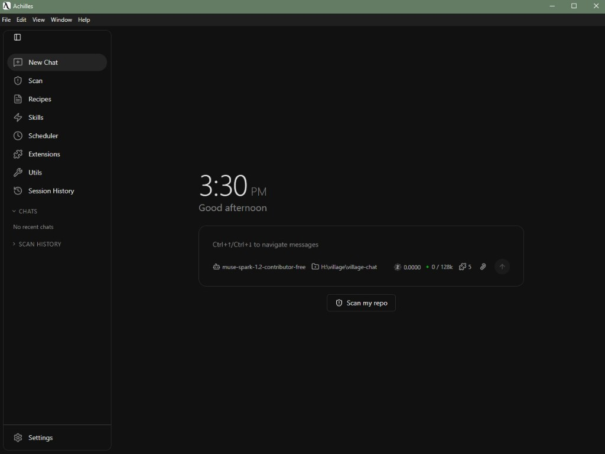
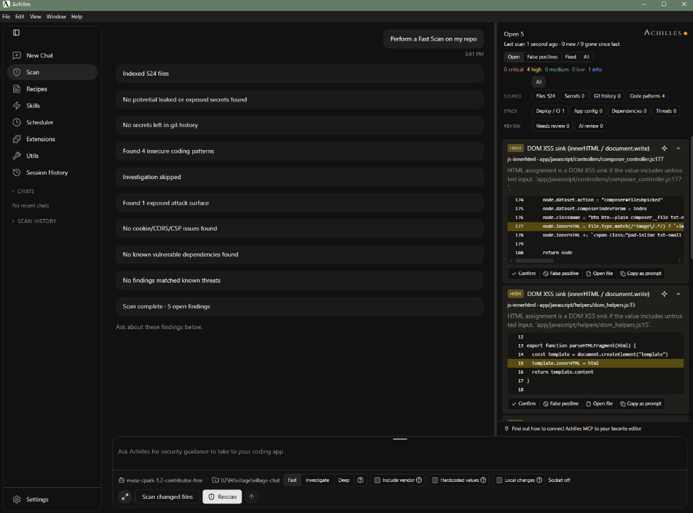
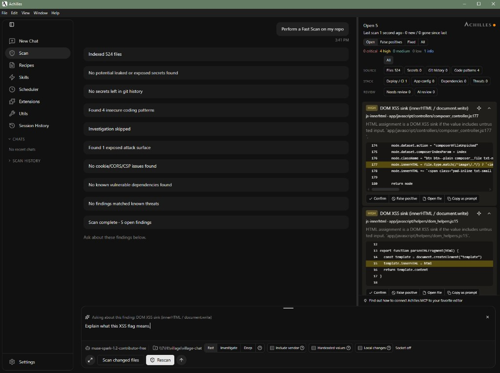
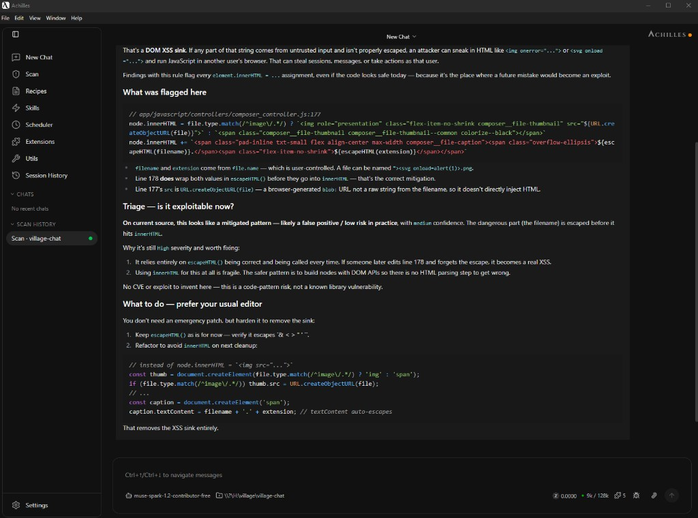

# Achilles

**Achilles** is a local agent harness: a native desktop app (Rust core, Electron shell) that runs tools, talks to models, and includes AppSec scanning as a first-class technical preview.

It is a fork of [goose](https://github.com/aaif-goose/goose). Goose is Apache-2.0; this tree is Apache-2.0 as well (goose-derived code and original Achilles / Arrav source). See [LICENSING.md](LICENSING.md), [LICENSE-APACHE](LICENSE-APACHE), and [NOTICE](NOTICE). This is not MIT. Goose and AAIF do not endorse Achilles.

**Arrav** is the optional local model for Achilles. It is not required to use the harness; any configured provider works today.

| Name | What it is |
|------|------------|
| **Achilles** | The harness (desktop UI, CLI, agent runtime, AppSec engines) |
| **Arrav** | The local model that runs inside the harness (optional, not required) |
| **goose** | Upstream project this fork is based on |

## Preview

<p align="center">
  
  
</p>
<p align="center">
  
  
</p>

## What you can do

The product path is **desktop Findings**:

1. Choose a workspace (your repo).
2. Scan the tree, or scan git-changed files.
3. Triage findings on the cards.

Engines write a local ledger (`achilles.db`) on your machine. Depths: **fast** (engines only), **investigate**, and **deep** (engines, then an agent loop on ledger ids only — the model does not invent findings).

Findings cover leaked secrets (including local git history on a full-tree scan), SAST-lite on tagged languages, deploy/CI/IaC surfaces, and SCA (lockfiles → OSV, plus pinning/hygiene). Optional extras use env vars when you set them (Socket, NVD, and similar). Repair is not an Achilles job: copy a brief or use Tools / MCP and apply patches in the editor you already use.

This is a **technical preview**, not a completed scanner product. GitHub Releases ship **installers** built on GitHub-hosted runners: Windows `AchillesSetup.exe`, macOS `.dmg`, Linux `.deb`/`.rpm`/`.flatpak`. They are unsigned; Windows SmartScreen and macOS Gatekeeper warnings are expected.

## Run from source

From the repo root (Git Bash on Windows):

```bash
./start-desktop.sh
```

Or double-click `start-desktop.cmd`. First run compiles the CLI (several minutes). Later runs reuse that binary unless you pass `--rebuild`. `--help` lists `--debug`, `--skip-build`, and `--full`.

When the window opens: pick a model if onboarding asks → **Findings** → **Choose workspace** → `examples/achilles-scan-fixture` → **Scan my repo**.

### Prerequisites

- [Rust](https://rustup.rs/) (see `rust-version` in the root `Cargo.toml`)
- C/C++ toolchain (MSVC Build Tools on Windows)
- Node.js + pnpm (Hermit can provide these)
- Git

Hermit (recommended):

```bash
source ./bin/activate-hermit
cargo build --release -p goose-cli --bin goose
```

Desktop:

```bash
cd ui/desktop
pnpm install
pnpm run start-gui
```

Or from the repo root with [just](https://github.com/casey/just):

```bash
just run-ui        # release CLI, then Electron
just run-ui-only   # UI only (CLI binary already in place)
```

The desktop app launches a bundled CLI binary (`goose` internally) and talks to it over ACP. The product brand is Achilles.

Python-oriented install notes: [requirement-guidance.html](requirement-guidance.html).

## CLI (CI / headless)

The interactive product is desktop Findings. The CLI binary is still named `goose`:

```bash
goose appsec scan --path examples/achilles-scan-fixture
goose appsec query --path examples/achilles-scan-fixture
```

`quick` (default) walks the tree. `--mode diff` limits secrets/SAST/surfaces to git-changed files; SCA still reads lockfiles.

Synthetic example trees (documentation-shaped values only, not real credentials): `examples/achilles-scan-fixture/` and `examples/achilles-fixtures/`.

## Tests

```bash
cargo test
cargo fmt
cargo clippy --all-targets -- -D warnings
cd ui/desktop && pnpm run typecheck && pnpm test
```

## Project map

```
crates/goose*           # agent core, CLI, MCP, local inference
crates/achilles-store   # AppSec ledger and engines
ui/desktop/             # Electron Achilles UI
docs/                   # Achilles product docs
examples/               # synthetic scan fixtures
LICENSING.md            # Apache 2.0 + goose attribution
AGENTS.md               # how to work in this repo
```

## Upstream goose

```bash
git fetch upstream
git log HEAD..upstream/main --oneline
```

`upstream` is [aaif-goose/goose](https://github.com/aaif-goose/goose). Merge or cherry-pick deliberately; keep Apache notices intact.
